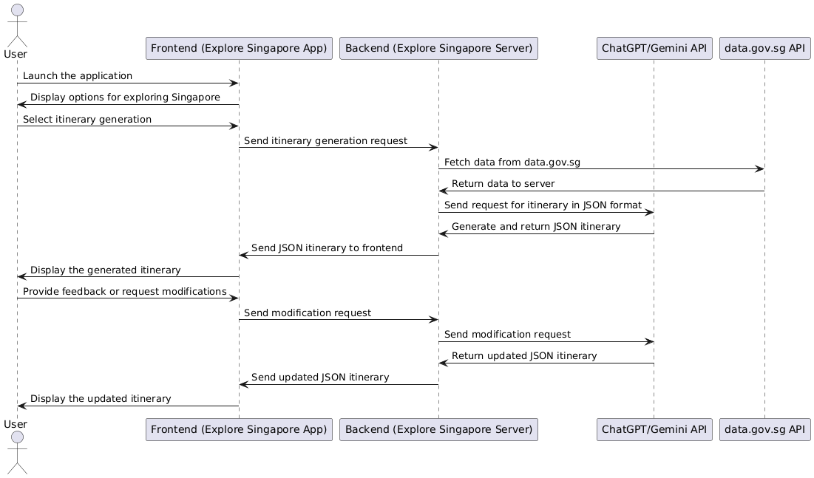
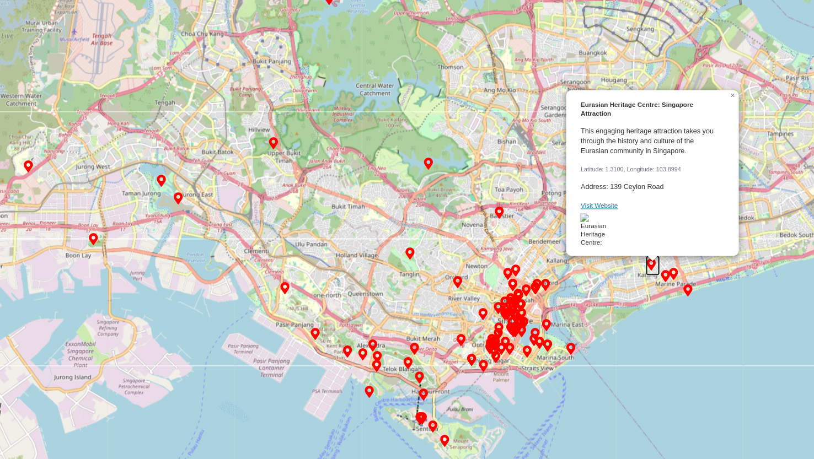

<H1>Explore Singapore</H1>

Singapore is a metropolitan city with the very rich culture and history. It also has a lot of attractions, indoor and outdoor to explore. XploreSingpore is a comprehensive platform designed to help both tourists and locals explore Singapore. This app would showcase everything Singapore has to offer, from its iconic landmarks like Marina Bay Sands and Gardens by the Bay to hidden gems such as lesser-known parks, hawker centres, and cultural hubs. Users can view customized itineraries, get real-time travel tips, and even learn about events and promotions in the city.

## Use Cases

. User can explore the app without Sign-in.
. For Tourists: Discover attractions, plan trips, and get around Singapore easily.
. For Locals: Find new places to visit, check out events, or explore dining options.
. User can do asking chatbot, making planner, bookmarks, reviews rating and comments via creating an account.

## Features

- ChatGPT powered itinerary planner
- Users able to collect and save the places
- Users can also comment and share their experience and tips for the trip
- Users can also Zoom in and Explore Singapore on a map and explore its hidden places
- There will also be a option to find the vibrant food scenary
- Various types of itineraries for different profiles of visitors like honeymoon couples, Parents with infants, Retirees
- Links to various attractions and its ticketing systems integrated
- Showcase major attractions by categories:
  . National landmarks such as Marina Bay Sands, Gardens by the Bay, Sentosa, Merlion Park.
  . Cultural spots like Chinatown, Little India, Kampong Glam.
  . Historical (e.g: National Gallery, Asian Civilisations Museum).
  . Nature (eg: Bukit Timah Nature Reserve, East Coast Park).
  . Foods (e.g: famous hawker centres, Michelin-starred stalls).
  . Shopping (e.g: Orchard Road, Bugis Street).
- Provide key information:
  . Entry fees, timings, nearby transportation options, and facilities.

## Sequence Diagram 

## MVP

> Intitial version of API integration completed at `9-maps-proof-of-concept`

- So theoretically, we should be able to ovelay the information as required.

## Features Wishlist

- Maybe integrating with the hotel price comparision feature.
- To achive comment and sharing parts, we need to have a signup/signin feature. and of course the corresponding functions.
- Having a CMS(content management system) to regulate the content published.
- Supporting navigation and search feature. Maybe by jumping to citymapper / google map APP.

## Concerns

- Do we have enough ability to materialise the idea?
- Admin portal feature to add articles and content
- Is ChatGPT reliable?
- How do we match the place ChatGPT gives with the actual place? In other words, how to handle the alias name. e.g. ChatGPT gives a place name as "NUS" but the actual name is "National University of Singapore". (if we do need to handle this scenario)

   

<H1>Renter Score (Property Rental Rating Application)</H1>

## Overview
   There are numerous property listings platforms but they lack a unified and reliable rating systems to evaluate properties,agents or landlords.Additionally the process is time-consuming as users often have to nagivate through multiple platforms to find suitable options. 

## Problem Statement
   There are many property listing platforms, but they often have duplicate listings, lack detailed information, and make it time-consuming to find a rental property. Renters also face issues like scammers asking for deposits before viewings and unexpected problems after signing a lease due to differing expectations. Renters sometimes have to contact multiple agents for the same listing due to listings being on different platforms or landlords working with multiple agents. Additionally, users often rely on listing photos that may not be updated or accurate, and many not align with the room’s criteria or requirements. A clear, reliable rating system could help address these problems. <del> This project aims to create an app that provides structured feedback and ratings for tenants, property agents, and landlords, focusing on transparency, fairness, and constructive insights to improve the rental process for all parties involved.</del>

## Objective of the Project
   To develop a unified/focused platform that allows users to rate and review properties,agents and landlords based on key criteria such as property condition, pricing and communication.The app aims to steamline the rental search process by consolidating listing, providing structured feedback  and improving transparency and trust within the rental ecosystem. 

## Key Features

**1. Tenant Profile:**
   Tenants can create and maintain their own profiles, including information such as rental history, preferred property types, budget, and location preferences. This allows landlords and agents to view potential renters' background, making the rental process more efficient.
   
**2. Agent and Landlord Profiles:**
   Property agents and landlords can create profiles to track their listings and ratings, ensuring transparency and accountability.
   
**3. Property Ratings:**
   Users (tenants, property agents, landlords) can rate rental properties based on multiple criteria such as property condition, pricing, and communication etc.
   
**4. Structured Feedback:**
   Tenants, property agents, and landlords can leave detailed feedback to provide more context to the ratings, ensuring reviews are informative and constructive.
   
**5. Property Comparison Tool:**
   A feature that allows tenants to compare (multiple properties? or within a building?) based on their ratings, price, and feedback to make more informed decisions.
      
**6. Verification Process:**
   To ensure authenticity, renters and property agents can verify their identities and past experiences, reducing the chances of fake reviews or scams.

**7. Search and Filter Options:**
   Tenants can search for properties based on key criteria such as available date, location, price range, property type, and ratings to find the best options faster.
   
**8. Notification System:**
   Tenants will receive updates on new listings, rental suggestions, lease ending or renewal due, rating updates, and messages from property agents or landlords.
   
**9. Report and Dispute System:**
   Tenants can flag inappropriate or misleading ratings and reviews, ensuring the platform remains trustworthy.
   
**10. Paperless Contract:**
    Tenants and landlords can sign rental agreement digitally,reducing paperwork and ensuring a secure, effecient leasing process.
    
**11. Insights for Agents:**
    Property agents can access detailed reports and statistics on their listing's performance like number of views,enquires,rating and feedback.This feature helps agents understand market trends,improve their services and optimize their property listings.
    
## Ideas
Rating UI Sample

Maybe we don't need to reveal exact location?

Price comparison

## Features Wishlist

- Introduce a chatbot to help users find their room based on their preferences.
- Maybe need a CMS as well.
- Tenant / Agent / Landlord ratings.
  
## General Architecture: 

## Scope of Work:
Key use case: 
Tenant 
- Tenant can post their review of a certain property. 
- Tenant can view other tenant’s reviews of a certain property. 
Admin 
- Admin can delete improper review.
Usecase:

  
## To be
- Once the project is confirmed, we all can start working on project timeline and plan Agile sprints on each feature.
- to discuss and create sprint template
  
## Concerns

- How do we get the data for the application
   - we probable can only mock up by ourself. as review is the key feature of the platform, and existing platform don't have reivew data.
- Compliance and legal aspect of crawling data across different property sites
   - if we don't really publish it into public place, it should be ok, this is just a school project. 
- How do we manage duplicate entries
   - how to identify each address, we can discuss which level of accurate it need to be. most of the address of Singapore are structural, they follow the structure: street -> block -> unit -> floor (postal code is actually optional for most of the cases) 
- How do we identify the property? Because there is no house number like #21-3-304 on the platform. (maybe due to privacy protection? landloard might not want to disclose the exact location)
- Are ratings sufficient enough to be used for comparison? because the lease term is long and not everyone want to rate after move out.
   - I think social media kind of app more or less face this problem right?
 
## Timeline

- Professor mentioned in PPT that about 10 man-days of effort per participant is expected. 
- 8 hours per day * 10 days = 80 hours works.
- 80 hours / 17 weeks = about 5 hours per week. (including meeting, planning, coding, discussion, review, testing, documentation...)

| Week | Start Date | End Date |
| ---- | ---------- | -------- |
|Proposal Submission|2025-01-16|2025-01-24|	 
|Proposal Review|2025-01-25|2025-01-31|	 
|0  |2025-02-03|    2025-02-09|
|1	|2025-02-10|	2025-02-16|
|2	|2025-02-17|	2025-02-23|
|3	|2025-02-24|	2025-03-02|
|4	|2025-03-03|	2025-03-09|
|5	|2025-03-10|	2025-03-16|
|6	|2025-03-17|	2025-03-23|
|7	|2025-03-24|	2025-03-30|
|8	|2025-03-31|	2025-04-06|
|9	|2025-04-07|	2025-04-13|
|10	|2025-04-14|	2025-04-20|
|11	|2025-04-21|	2025-04-27|
|12 |2025-04-28|	2025-05-04|
|Project Presentation|2025-05-05|2025-05-11|
|Report Submission|2025-05-12|2025-05-18|

<H1><del>Food and Workout Recommender System</del></H1>

A lot of people are having a tough time having a healthy life, including maintaining weight and an active lifestyle.

The application can have the following features

- user inputs the current weight and target weight.
- Application will analyse and suggest a workout schedule and food (based on preferences)
- User can also get recommendations on what can be done and motivation
- Gamification
- Helpful activities
- Integration into Google API for food places
- Integration into weather API for workouts

## References

1. [Park Connector API](https://data.gov.sg/datasets/d_a69ef89737379f231d2ae93fd1c5707f/view)
2. [Gym API](https://data.gov.sg/datasets?topics=health&page=1&resultId=d_b3ae090692ecf632116c9885cfbd3424)
3. [Parks API](https://data.gov.sg/datasets?topics=health&page=1&resultId=d_99b71f5d34cf57a3a592fbfdef1f42b6)

<H1><del>Dashboard Application</del></H1>

A tool to visualise the different types of data and auto generate reports for a company XYZ

- we can have a chatbot to ask questions about a topic
- If really keen, we can even deploy an AI model to respond based on the dataset that we have prepared
- We can also add a mobile application as a frontend along with the web application

## Features List

- Visualisation and Graphs
- Authentication
- REST API
- Chatbot implementation
- Introduction Web page

## Proposed Stack

### Frontend

- React
- TailwindCSS
- Vite

### Backend

- Python
- FastAPI

### Mobile Application

- Android

### Database

- MongoDB
- PosgreSQL

### Devops

- Github Actions
- Docker
- AWS

## Example

<H1><del>ROS Control Interface</del></H1>

A Tool to control the interface between a ROS operating system in a Robot)

<H1><del>A Mental Health Support Chatbot</del></H1>

A Web application that will help people have a voice to listen to, powered by AI

