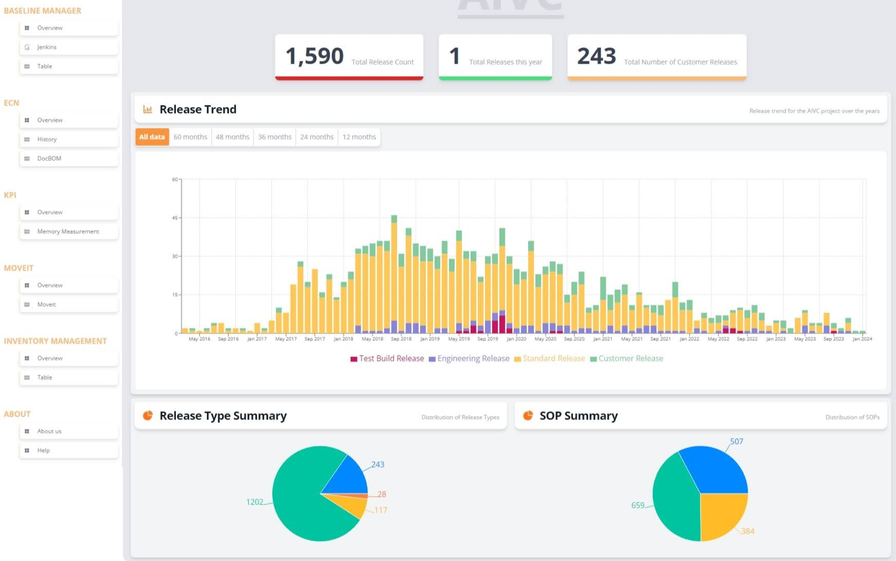

# Explore Singapore 
Singapore is a metropolitan city with the very rich culture and history. It also has a lot of attractions, indoor and outdoor to explore. XploreSingpore is an application is an application that will enable Locals and Visitors alike to explore about Singapore in as many layers as they like and learn more. 

## Features 
- ChatGPT powered itinerary planner
- Users able to collect and save the places
- Users can also comment and share their experience and tips for the trip
- Users can also Zoom in and Explore Singapore on a map and explore its hidden places
- There will also be a option to find the vibrant food scenary
- Various types of itineraries for different profiles of visitors like honeymoon couples, Parents with infants, Retirees
- Links to various attractions and its ticketing systems integrated

## Features Wishlist 
- Maybe integrating with the hotel price comparision feature.
- To achive comment and sharing parts, we need to have a signup/signin feature. and of course the corresponding functions.
- Having a CMS(content management system) to regulate the content published.
- Supporting navigation and search feature. Maybe by jumping to citymapper / google map APP.

## Concerns 
- Do we have enough ability to materialise the idea?
- Admin portal feature to add articles and content
- Is ChatGPT reliable?
- How do we match the place ChatGPT gives with the actual place? In other words, how to handle the alias name. e.g. ChatGPT gives a place name as "NUS" but the actual name is "National University of Singapore". (if we do need to handle this scenario)

# Property Rental Rating/Review Application (RenterScore)

## Problem Statement
There are many property listing platforms, but they often have duplicate listings, lack detailed information, and make it time-consuming to find a rental property. Renters also face issues like scammers asking for deposits before viewings and unexpected problems after signing a lease due to differing expectations. A clear, reliable rating system could help address these problems. This project aims to create an app that provides structured feedback and ratings for tenants, property agents, and landlords, focusing on transparency, fairness, and constructive insights to improve the rental process for all parties involved.

## Objective of the Project
To create an app that allows tenants, property agents, and landlords to rate rental properties based on key criteria such as property condition, pricing, and communication. The goal is to provide clear, structured feedback to improve decision-making and enhance trust in the rental process.

## Key Features
1.	Tenant Profile:
Tenants can create and maintain their own profiles, including information such as rental history, preferred property types, budget, and location preferences. This allows landlords and agents to view potential renters' background, making the rental process more efficient.
2.	Agent and Landlord Profiles:
Property agents and landlords can create profiles to track their listings and ratings, ensuring transparency and accountability.
3.	Property Ratings:
Users (tenants, property agents, landlords) can rate rental properties based on multiple criteria such as property condition, pricing, and communication etc.
4.	Structured Feedback:
Tenants, property agents, and landlords can leave detailed feedback to provide more context to the ratings, ensuring reviews are informative and constructive.
5.	Property Comparison Tool:
A feature that allows tenants to compare multiple properties based on their ratings, price, and feedback to make more informed decisions.
6.	Verification Process:
To ensure authenticity, renters and property agents can verify their identities and past experiences, reducing the chances of fake reviews or scams.

7.	Search and Filter Options:
Tenants can search for properties based on key criteria such as available date, location, price range, property type, and ratings to find the best options faster.
8.	Notification System:
Users will receive updates on new listings, rental suggestions, lease ending or renewal due, rating updates, and messages from property agents or landlords.
9.	Report and Dispute System:
Tenants can flag inappropriate or misleading ratings and reviews, ensuring the platform remains trustworthy.

## Features Wishlist  
- Introduce a chatbot to help users find their room based on their preferences.
- Maybe need a CMS as well.
- Tenant / Agent / Landlord ratings.

## Concerns 
- How do we get the data for the application
- Compliance and legal aspect of crawling data across different property sites
- How do we manage duplicate entries
- How do we identify the property? Because there is no house number like #21-3-304 on the platform. (maybe due to privacy protection? landloard might not want to disclose the exact location)
- Are ratings sufficient enough to be used for comparison? because the lease term is long and not everyone want to rate after move out.

# ~Food and Workout Recommender System~
A lot of people are having a tough time having a healthy life, including maintaining weight and an active lifestyle. 

The application can have the following features
- user inputs the current weight and target weight.
- Application will analyse and suggest a workout schedule and food (based on preferences)
- User can also get recommendations on what can be done and motivation
- Gamification
- Helpful activities
- Integration into Google API for food places
- Integration into weather API for workouts

## References 
1. [Park Connector API](https://data.gov.sg/datasets/d_a69ef89737379f231d2ae93fd1c5707f/view)
2. [Gym API](https://data.gov.sg/datasets?topics=health&page=1&resultId=d_b3ae090692ecf632116c9885cfbd3424)
3. [Parks API](https://data.gov.sg/datasets?topics=health&page=1&resultId=d_99b71f5d34cf57a3a592fbfdef1f42b6)

# ~Dashboard Application~

A tool to visualise the different types of data and auto generate reports for a company XYZ

- we can have a chatbot to ask questions about a topic
- If really keen, we can even deploy an AI model to respond based on the dataset that we have prepared
- We can also add a mobile application as a frontend along with the web application

## Features List

- Visualisation and Graphs
- Authentication
- REST API
- Chatbot implementation
- Introduction Web page

## Proposed Stack

### Frontend

- React
- TailwindCSS
- Vite

### Backend

- Python
- FastAPI

### Mobile Application

- Android

### Database

- MongoDB
- PosgreSQL

### Devops

- Github Actions
- Docker
- AWS

## Example

# ~ROS Control Interface~

A Tool to control the interface between a ROS operating system in a Robot)

# ~A Mental Health Support Chatbot~

A Web application that will help people have a voice to listen to, powered by AI
